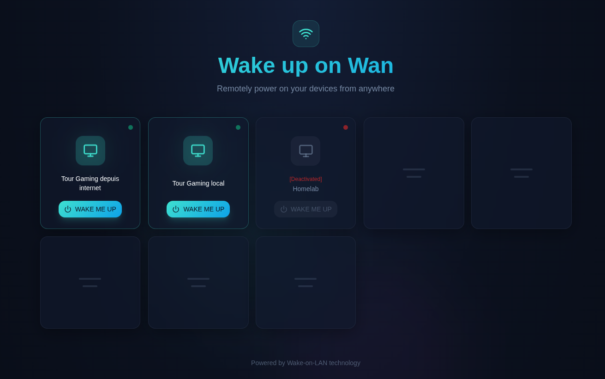

# Wake Me Up - "Wake-on-WAN" Application

A modern web application for sending Wake-on-LAN (WOL) packets to wake up servers on your network without exposing IP / Mac to frontend.




## Features

- ASP.NET Core Web API backend
- React frontend
- Configure multiple servers via configuration file
- Beautiful, responsive UI with smooth animations
- Real-time feedback when waking servers
- **Secure**: Network information (MAC, broadcast, gateway) never exposed to frontend

## Prerequisites

- .NET 9 SDK or later
- Node.js 18+ and npm

## Configuration

Edit `Backend/appsettings.json` to configure your servers:

```json
{
  "Servers": [
    {
      "Name": "Your Server Name",
      "MacAddress": "00:11:22:33:44:55",
      "GatewayIp": "192.168.1.1"
    }
  ]
}
```

### Configuration Fields

- **Name**: Display name for the server
- **MacAddress**: MAC address of the server's network card (formats: `00:11:22:33:44:55` or `00-11-22-33-44-55`)
- **GatewayIp**: Your network gateway IP address

## Quick Start

### Using Makefile (Recommended)

The project includes a Makefile with convenient commands:

```bash
# Install all dependencies
make install

# Run integrated application (frontend + backend on same port)
make dev

# Build both projects
make build

# Create production build (self-contained application)
make publish

# Build Docker image for deployment
make package
```

Run `make help` to see all available commands.

### Deploy

If you prefer to run the application manually:

```bash
  docker run -d \
    --name wakemeup \
    -p 127.0.0.1:8080:8080 \
    -v /app/appsettings.Production.json:/app/appsettings.Production.json:ro \
    --restart unless-stopped \
    myowndockerhubaccount/wake-me-up:1.0
```

> [!WARNING]
> The webapplication does not implement an authentification mecanism!

## License

This project is provided as-is for educational and personal use.
